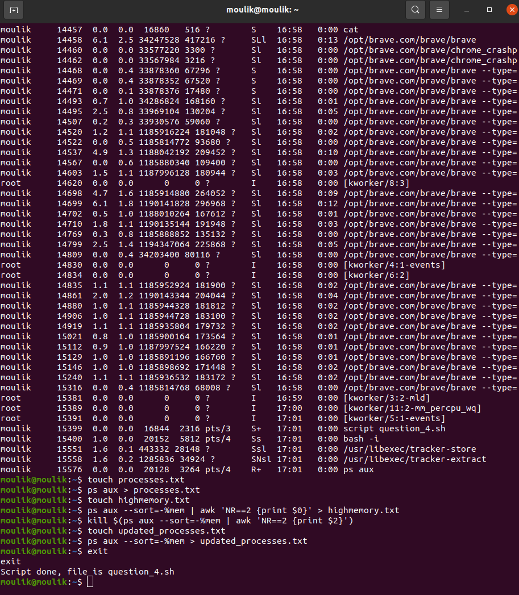

# The Linux Environment
## Moulik Tammana
## College: Amrita Vishwa Vidyapeetham


## 1.Use the appropriate command to list all files larger than 1 MB in the current directory and save the output to a file.
  1. We use the following command to list all the files in directory with details.
     ```bash
     ls -lt
     ```
     
  2. According to the question we need to filter the files which are larger than 1 MB = 1024 KB and also store the output in to a file output.txt.
     ```bash
     ls -lt | awk '$5>1024 {print $0}' > output.txt
     ```
     


## 2.Replace all occurrences of "localhost" with "127.0.0.1" in a configuration file named config.txt, and save the updated file as updated_config.txt.
We use the following command to replace all the occurrences of "localhost" with 127.0.0.1
```bash
sed -i 's/localhost/127.0.0.1/g' config.txt
```


## 3.Use the appropriate command to search for lines containing the word "ERROR" in a log file but exclude lines containing "DEBUG". Save the results to a file named filtered_log.txt.
  1. Create a directory log.txt and add the log text provided.
     ```bash
     touch log.txt && cat > log.txt
     ```
  2. We use the grep command to locate all the "ERROR" word occurrences and print those lines.
     ```bash
     grep -i "ERROR" log.txt
     ```
  3. Creating a file named filtered_log.txt to store all the error lines.
     ```bash
     grep -i "ERROR" log.txt > filtered_log.txt
     ```
      

## 4.Write a code to identify the process with the highest memory usage and then terminate it.
  1. ps aux command is used ot list all the running processes with detailed information, including memory.
     ```bash
     ps aux
     ```
  2. Us the sort command to sort the processes according the their memory usage.
     ```bash
     ps aux --sort=-%mem | awk 'NR==2 {print $0}'
     ```
  3. kill the process which uses the highest memory
     ```bash
     kill $(ps aux --sort=-%mem | awk 'NR==2 {print $2}')
     ```
       

## 5.Use the networking tool command and print all the gateway available in a sorted manner.
  1. Displaying the kernel's routing table with numeric addresses.
     ```bash
     netstat -rn
     ```
  2. sort the gateway according to the gateway value.
     ```bash
     netstat -rn | awk 'NR>2 {print $2}' | sort -k2n
     ```
     