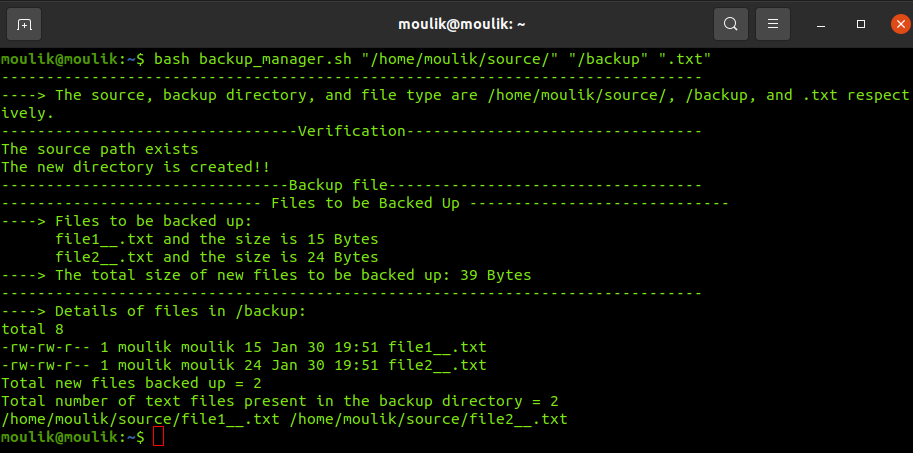
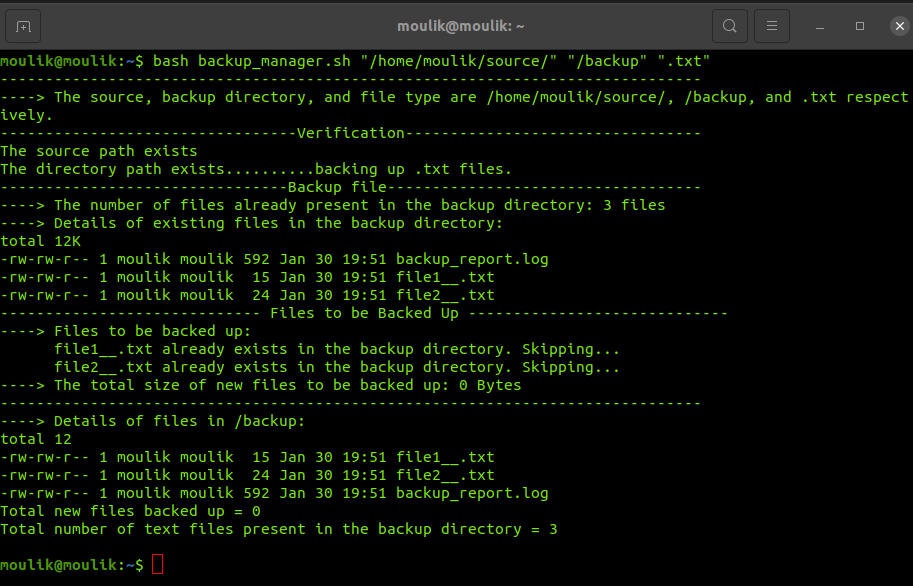

#  Linux distributions and Scripting Languages
## Moulik Tammana
## College: Amrita Vishwa Vidyapeetham

## Automating file backup and Reporting to the system. Create a shell script called "backup_manager.sh" that performs the following tasks incorporating the concepts suggested.

### --> The above screenshot shows that tha directory for the backup doesn't exist and the directory is being created.

### --> When we run the terminal command again, the script checks if the text files already exist and then based on the text files update into the backup directory.

     

