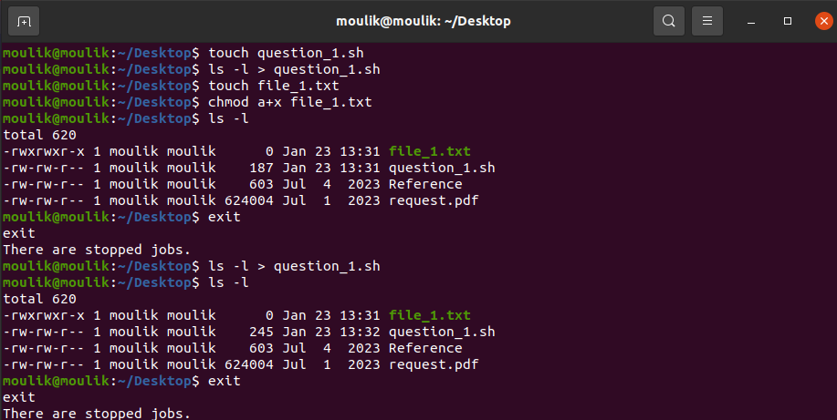
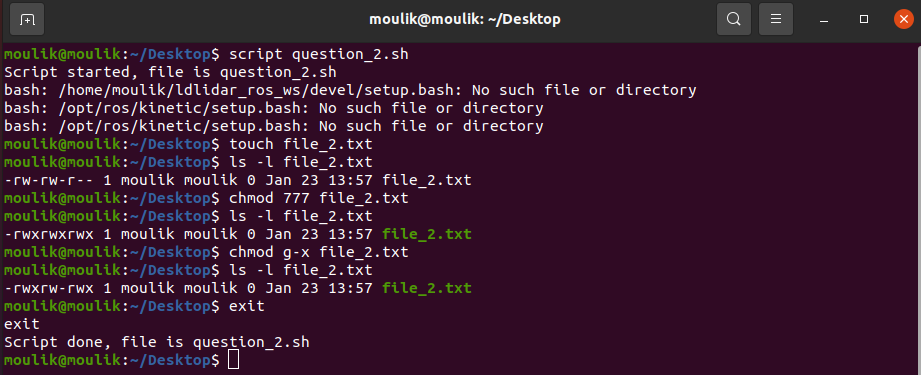
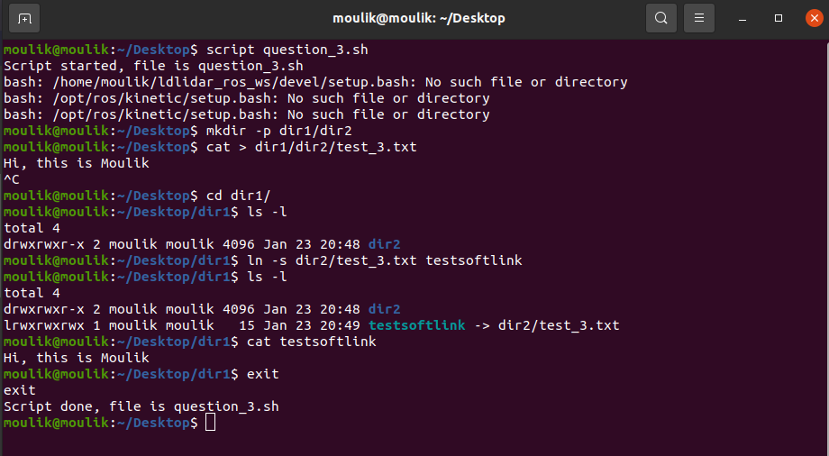
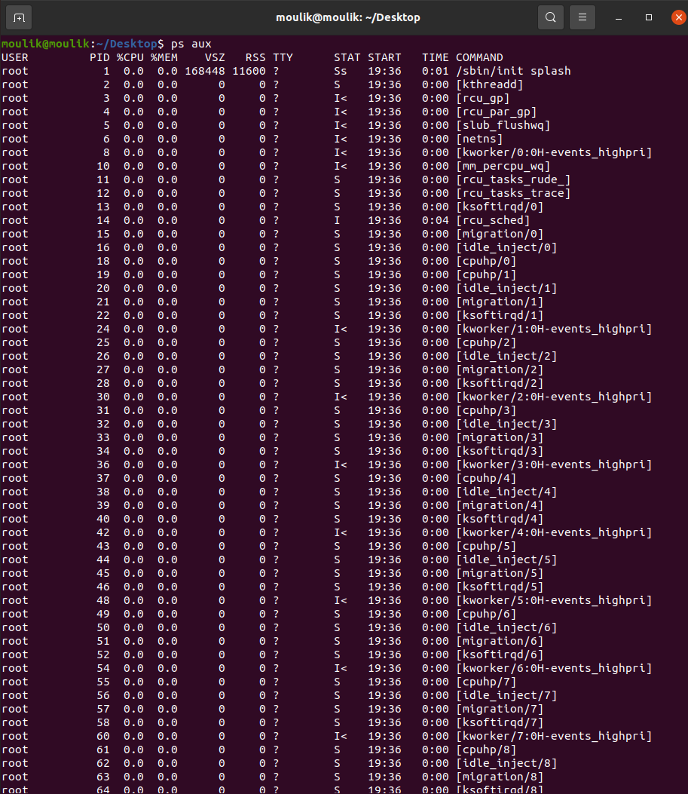
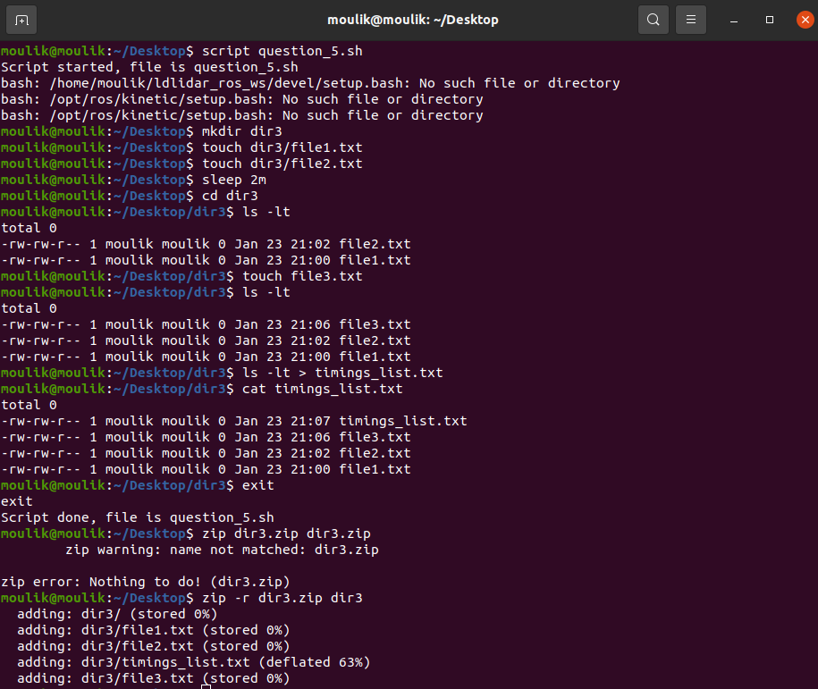

# Introduction to Linux OS, Architecture and Kernel
## Moulik Tammana
## College: Amrita Vishwa Vidyapeetham


## 1.Create a file and add executable permission to all users.
  1. Creating a file
     ```bash
     touch <filename>
     ```
  2. Add executable permission for all types of users (user,group,other)
     ```bash
     chmod a+x <filename>
     ```
  3. Verify all the permission
     ```bash
     ls -l <filename>
     ```
     

## 2.Create a file and remove write permission for group user alone.
  1. Creating a file
     ```bash
     touch <filename>
     ```
  2. Remove executable permission for group type of user
     ```bash
     chmod g-x <filename>
     ```
  3. Verify all the permission
     ```bash
     ls -l <filename>
     ```
     

## 3.Create a file and add a softlink to the file in different directory.
  1. Create a directory dir1,dir2 and a text file
     ```bash
     mkdir -p dir1/dir2 && cd dir1/dir2 && touch test_3.txt
     ```
  2. Going back to parent directory
     ```bash
     cd ..
     ```
  3. Creating the softlink
     ```bash
     ln -s dir2/test_3.txt testsoftlink
     ```
  4. Verify the softlink
     ```bash
     cd dir1 && cat > testsoftlink
     ```
     

## 4.Use ps command with options to display all active process running on the system.
   We use the aux option under the ps command to print the detailed information regarding the running processes.
   ```bash
   ps aux
   ```
   

## 5.Create 3 files in a dir1 and re-direct the output of list command with sorted by timestamp.
  1. Create 3 files at different instance of time
     ```bash
     touch <filename>
     ```
     To wait, we can use the sleep command to pause the execution of a command for a specified amount of time. For example, the following command can  put the terminal to sleep for 2 minutes
     ```bash
     sleep 2m
     ```
  2. We can use the -lt command to sort the files according the time of creation
     ```bash
     ls -lt
     ```
      
