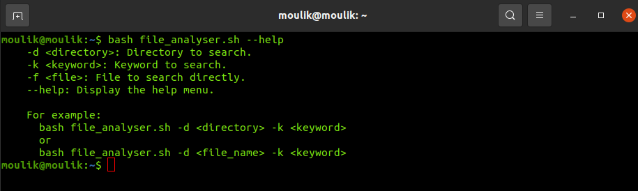

#  Advance topics in a function
## Moulik Tammana
## College: Amrita Vishwa Vidyapeetham


### 1.The below command is used to search a keyword in a file and the following is format that we have to use to specify the filename and the keyword to search.
```bash
bash file_analyser.sh -f <file_name> -k <keyword>
 ```


### 2.Similar to the above function above, the below command is used to search for a keyword mentioned in all the files present in a directory.
```bash
bash file_analyser.sh -d <directory_name> -k <keyword>
 ```
 

## 3.Use the appropriate command to list all files larger than 1 MB in the current directory and save the output to a file.
```bash
bash file_analyser.sh --help
 ```



  


