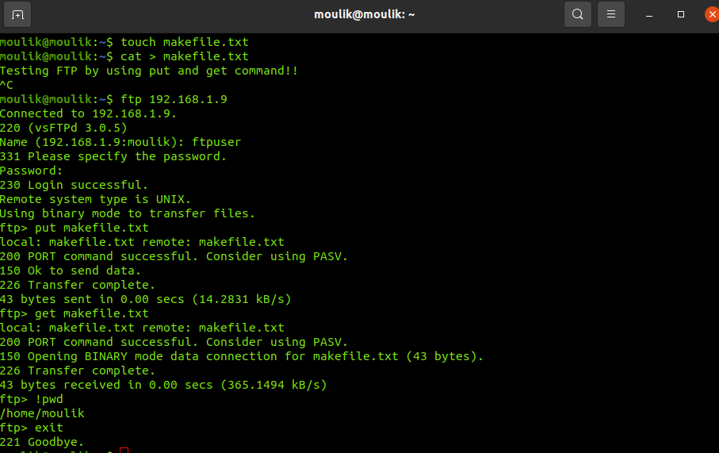
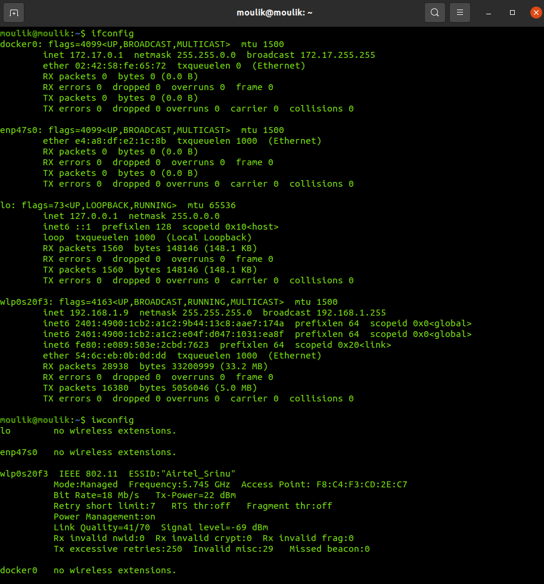

# Assignment - Module 1 and 2

## Question 1 : Copying a Folder with Multiple Files to a Destination (SCP, cp)
### 1. Docker and Container Creation
  
### 2. Two separate instances are created and made a folder in one instance
  
### 3. Used the scp command to copy the folder from instance one to instance two
  

## Question 2 : Host a FTP and SFTP server using PUT and GET commands.
### FTP 
  
### SFTP
  

## Question 3 : Explore with Wireshark/TCP-dump/cisco packet tracer tools and learn about packets filters
### Packet filters using Wireshark
Wireshark is a network protocol analyzer that captures and inspects network traffic in real time. It allows users to analyze packets to troubleshoot network issues, detect security threats, and monitor network performance. It works on multiple platforms, including Windows, Linux, and macOS.
Some filters used for packet filtering are upt,tcp,http and dns. We can also filter packets using MAC address.
For example, streaming YouTube videos can be observerd by receiving UDP packets in wireshark. So in Wireshark, if you filter for udp.port == 443, you're likely capturing the QUIC traffic from YouTube and ipv6 contains '2404:6800::' this prefix is part of Google's IPv6 address space.
  
  
### Packet filters using tcpdump
   
## Question 4 : Understand linux utility commands like - ping, arp (Understand each params from ifconfig output)
### 1. ping command by limiting the packets
  
### 2. arp command
  

## Question 5 : Understand what happens when duplicate IPs configured in a network.
When duplicate IP addresses are configured in a network, it leads to IP address conflicts, which can cause various issues depending on the network type and devices involved. Here’s what happens:
1. Routing Issues – Routers and switches may send traffic incorrectly, causing failures or security risks.
2. IP Conflict Errors – Operating systems detect conflicts and disable network interfaces.
3. Packet Misrouting – Traffic may reach the wrong device, causing data leaks.
4. Server Downtime – Critical systems may become unreachable, disrupting services.
5. VoIP and Streaming Failures – Real-time applications may experience drops and lag.

The solution is by using  DHCP (Dynamic Host Configuration Protocol) prevents IP conflicts by automatically assigning unique IP addresses to devices. It ensures efficient IP management, avoids manual errors, and dynamically reallocates addresses when devices disconnect or reconnect.

## Question 6 : Understand how to access remote system using (VNC viewer, Anydesk, teamviewer and remote desktop connections)

### VNC Viewer :
1. Install VNC Server on the remote device and VNC Viewer on the local device.
2. Ensure both devices are on the same network or set up port forwarding for remote access.
3. Open VNC Viewer, enter the remote device’s IP address, and authenticate with the required password.
4. Supports multi-user connections, screen sharing, and remote control, but requires manual setup.

### AnyDesk :
1. Download and install AnyDesk on both systems.
2. Launch the application and note the 9-digit AnyDesk address of the remote machine.
3. Enter the address in AnyDesk on the local device and send a connection request.
4. The remote user must approve the request unless unattended access is enabled.
5. Provides features like file transfer, session recording, and clipboard synchronization in a simple interface.

### TeamViewer :
1. Install TeamViewer on both systems.
2. Open the application and find the Partner ID and password on the remote device.
3. Enter the Partner ID on the local system and establish a connection.
4. The remote user must accept the connection unless unattended mode is configured.
5. Offers capabilities such as cross-platform remote access, remote printing, and file sharing.

### Remote Desktop Connection (RDP - Windows) :
1. Enable Remote Desktop on the target Windows system by navigating to:
2. Settings → System → Remote Desktop, then turn it on.
3. Retrieve the remote system’s IP address (using ipconfig in Command Prompt).
4. Open the Remote Desktop Client (mstsc.exe) on the local machine and input the IP.
5. Log in with the remote system’s username and password.

## Question 7 : How to check your default gateway is reachable or not and understand about default gateway.
  

## Question 8 : Check iwconfig/ifconfig to understand in detail about network interfaces 
  
  

## Question 9 : Log in to your home router's web interface (usually at 192.168.1.1 or 192.168.0.1) and check the connected devices list.
1. Find Your Router's IP Address: Open the terminal and run ip route | grep default. The IP after "default via" (e.g., 192.168.1.1) is your router's web address.
2. Open the Router’s Web Interface: Open a browser and enter http://192.168.1.1 or the IP found in the previous step.
3. Log In to the Router: Enter the username and password (default is often admin/admin or found on the router label).
4. Find the Connected Devices List: Navigate to "DHCP Clients," "Attached Devices," or "Connected Devices" in the router’s settings.
5. View Device Details: The list will show connected device names, IP addresses, and MAC addresses.
  
## Question 10 : Explain how a DHCP server assigns IP addresses to devices in your network.
Devices on a network are automatically assigned IP addresses and other network configuration settings (such subnet mask, gateway, and DNS servers) by the network management protocol known as DHCP (Dynamic Host Configuration Protocol). This helps prevent IP conflicts and does away with the necessity for manual IP address setting.

How DHCP Operates: 
DORA is the process that is used by DHCP. DORA helps in providing an IP address to hosts or client machines. DORA is the process that follows some steps between the server and client. It gets the IP address from the centralized server.
1. Discover: To locate accessible DHCP servers, a client (such as a PC or a mobile device) makes a broadcast request.
2. Offer: In response, a DHCP server provides the network configuration and an IP address that is accessible.
3. Request: The client requests to utilise one of the available IP addresses.
4. Acknowledgement (ACK): The server verifies that the client has been granted a lease on the IP address for a predetermined amount of time.

## Question 11 : Using a terminal, connect to a remote machine via SSH and telnet.
### Connecting to the remate machine using SSH login
  
### Connecting to the remote machine using telnet
  

